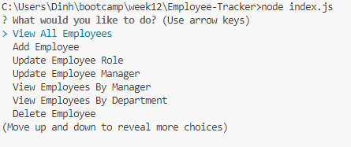

# Employee Tracker

## Description

Employee tracker is a command-line application to manage a company's employee database, using Node.js, Inquirer, and MySQL.

## Installation

Follow the below steps to install on local computer.
- Step 1: clone project to your local computer.
- Step 2: install mysql and nodejs.
- Step 2: run "npm install" to install the required modules.
- Step 3: connect by running "mysql -u root -p" and enter your password.
- Step 4: run "SOURCE db\schema.sql" to create database.
- Step 5: run "SOURCE db\seeds.sql" to init test data.
- Step 6: put mysql credentials in lib\models\model.js..
- Step 6: run "node index.js" to start the application.
    
## Usage

- Run "node index.js" to start the application.
- From menu, move cursor up/down by pressing arrow keys to choose the feature you want to use.
- Features: 
    - View all departments, all roles, all employees, employees by manager, employees by department;
    - Add a department, a role, an employee;
    - Update employee managers, an employee role;
    - Delete departments, roles, and employees;
    - View the total utilized budget of a department.

    

    

## Credits

App powered by [nodejs](https://nodejs.org/en), and [mysql](https://www.mysql.com/).

Inquirer sourced from [Inquirer](https://www.npmjs.com/package/inquirer/v/8.2.4).

mysql2 sourced from [mysql2](https://www.npmjs.com/package/mysql2).

as-table sourced from [as-table](https://www.npmjs.com/package/as-table).
